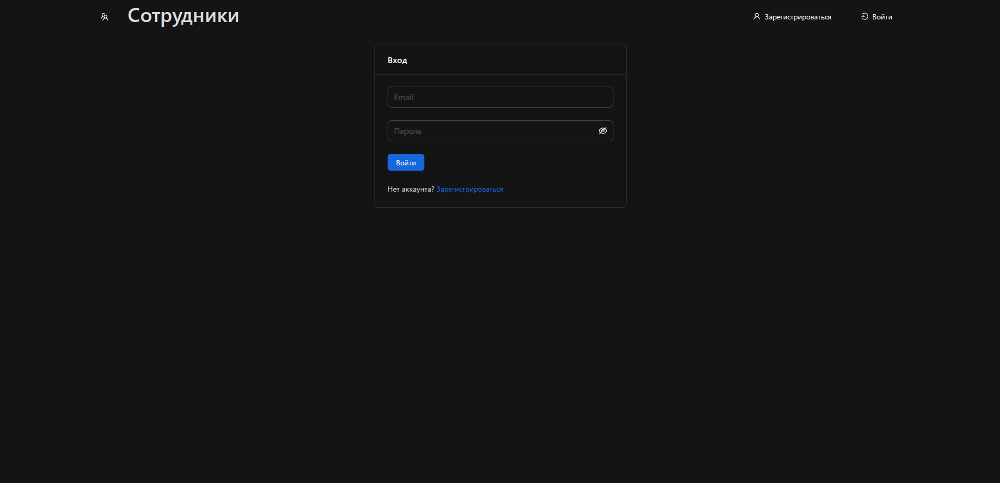
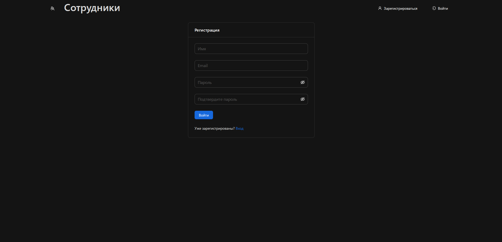
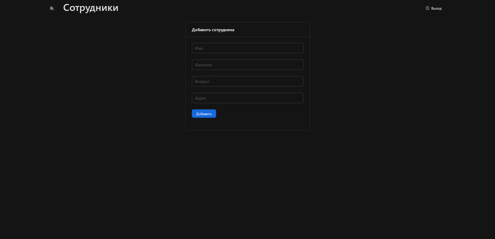
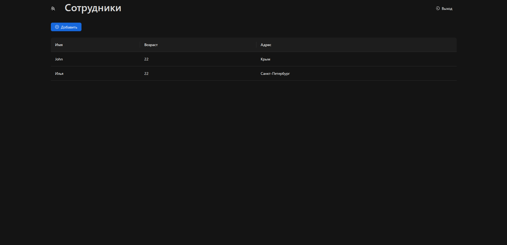
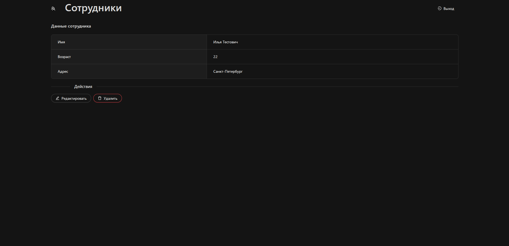

# Система управления сотрудниками

## Описание проекта

Это полноценное веб-приложение для управления сотрудниками компании, разработанное с использованием современного стека технологий. Приложение предоставляет удобный интерфейс для работы с данными сотрудников, включая их добавление, редактирование, удаление и просмотр.

## Функциональность

- Аутентификация и авторизация пользователей
- Управление данными сотрудников (CRUD операции)
- Современный и отзывчивый пользовательский интерфейс
- Защищенные маршруты и API endpoints
- Валидация данных на клиенте и сервере

## Технологии

### Backend

- Node.js
- Express.js
- Prisma ORM
- sqlite
- JWT для аутентификации
- bcrypt для хеширования паролей
- CORS для безопасного взаимодействия с фронтендом

### Frontend

- React 19
- TypeScript
- Redux Toolkit
- React Router
- Ant Design
- Vite

## Установка и запуск

1. Клонируйте репозиторий:

```bash
git clone [url-репозитория]
cd [название-проекта]
```

2. Установите зависимости для сервера:

```bash
npm install
```

3. Установите зависимости для клиента:

```bash
cd client
npm install
```

4. Настройте переменные окружения:
   Создайте файл `.env` в корневой директории и добавьте необходимые переменные:

```
PORT = номер порта
JWT_SECRET = "ваш ключ"
DATABASE_URL="file:./dev.db"
```

5. Выполните миграции базы данных:

```bash
npx prisma migrate dev
```

6. Запустите приложение:

Для разработки (запуск сервера и клиента одновременно):

```bash
npm run app
```

Для запуска только сервера:

```bash
npm run server
```

Для запуска только клиента:

```bash
npm run client
```

Для просмотра базы данных

```bash
npx prisma studio
```

## Структура проекта

```
├── client/                # Клиентская часть (React)
│   ├── src/               # Исходный код клиента
│   ├── public/            # Статические файлы
│   └── package.json       # Зависимости клиента
├── prisma/                # Схема базы данных и миграции
├── routes/                # Маршруты API
├── controllers/           # Контроллеры
├── middleware/            # Промежуточное ПО
├── app.js                 # Основной файл приложения
└── package.json           # Зависимости сервера
```

## API Endpoints

- POST /api/auth/login - Аутентификация
- POST /api/auth/register - Регистрация
- GET /api/employees - Получение списка сотрудников
- POST /api/employees - Создание нового сотрудника
- PUT /api/employees/:id - Обновление данных сотрудника
- DELETE /api/employees/:id - Удаление сотрудника

## Изображение

<p align="center">
  
  <br>Страница входа
</p>

<p align="center">
  
  <br>Страница регистрации
</p>

<p align="center">
  
  <br>Страница добавления сотрудника
</p>

<p align="center">
  
  <br>Страница просмотра всех сотрудников
</p>

<p align="center">
  
  <br>Страница просмотра выбранного сотрудника
</p>
